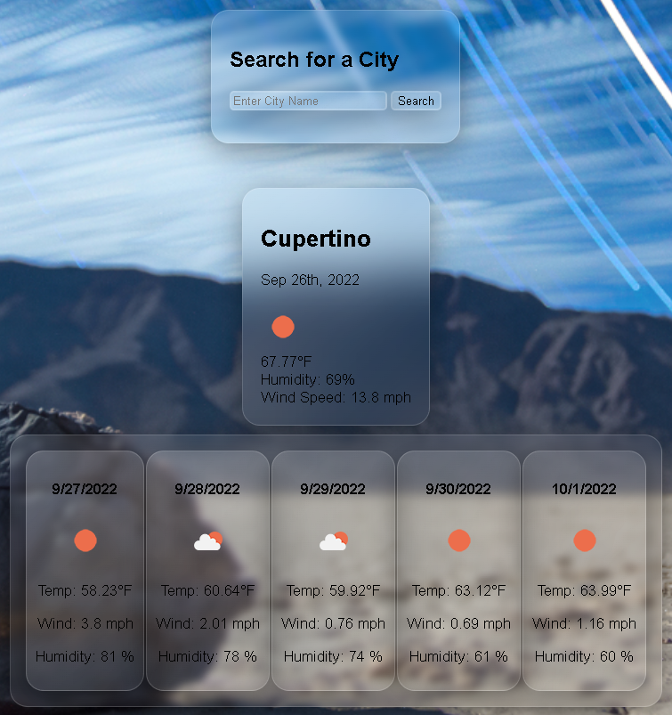
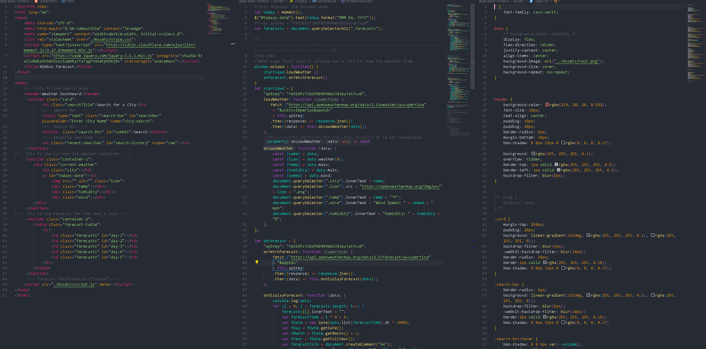

# operation-nimbus
A user friendly weather dashboard

## Description 
This webpage was designed as an easy interactive weather application. The user will be able to search a city in which they wish to find the current weather. They may also retrieve the forecast for the next 5 days in the chosen city. The users search history will be recorded, so that they may be able to go back and view prior searched cities. 

## Preview

## Deployed Link
[Deployed Webpage](https://eddiefigueroa18.github.io/operation-nimbus/)

## Credits
Eduardo Figueroa
[Github Profile](https://github.com/eddiefigueroa18)

[OpenWeather API](https://openweathermap.org/api)

## License
© 2012 — 2022 OpenWeather ® All rights reserved.
 
© 2022 Echo Industries. Confidential and Proprietary. All Rights Reserved.